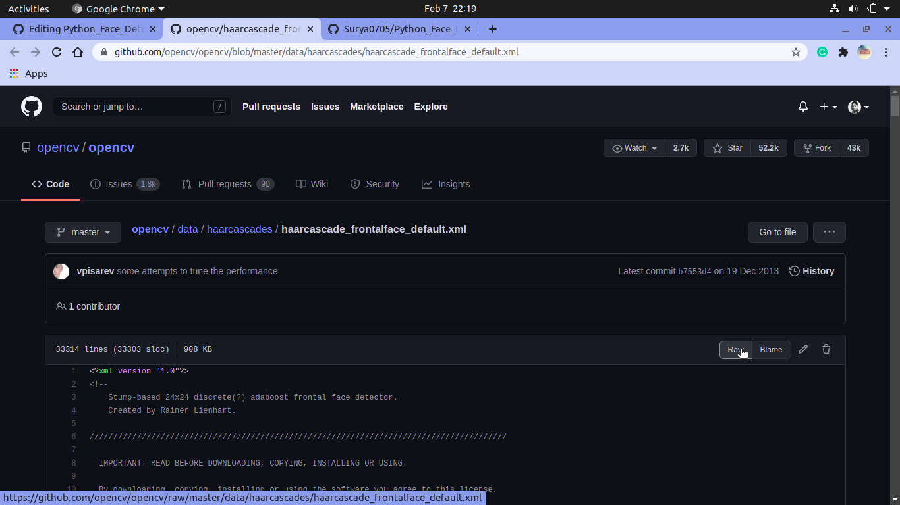
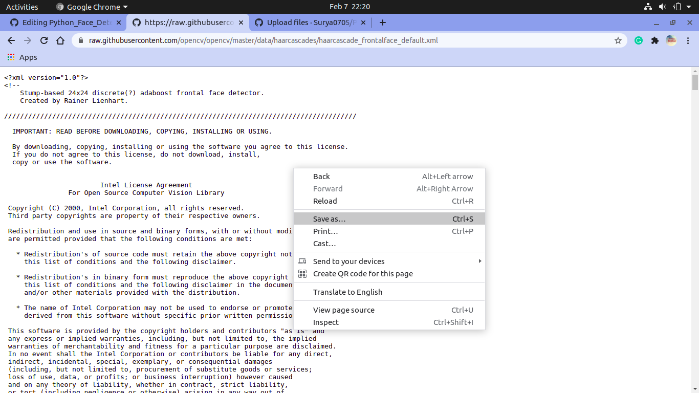
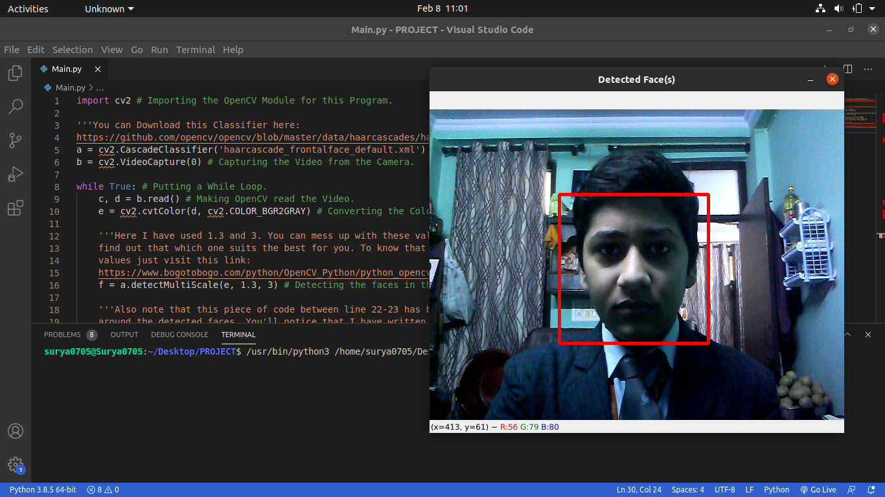

# Python_WebCam_Face_Detection
This is a Python Program that Detects the Faces through your WebCam. It uses OpenCV Python Module for this Purpose. To install this in your system just Use the following Command (Assuming that you are on Windows):
```
pip install opencv-python
```
Or if you are on Ubuntu (10.04 LTS which I use) then just type:
```
pip3 install opencv-python
```
Or Install it according to your OS. After Installation follow the Following Instructions:
1. Install the 'haarcascade_frontalface_default.xml' by going to this [Link ](https://github.com/opencv/opencv/blob/master/data/haarcascades/haarcascade_frontalface_default.xml).
2. After visiting click on 'Raw':

3. Then Right-Click and then choose Save As:

4. Then Save the file in Folder you are working within. Now run the [Main.py](Main.py) and you'll see the faces detected through your WebCam. Below is the screenshot of my Program:


And Hope that you liked it!
